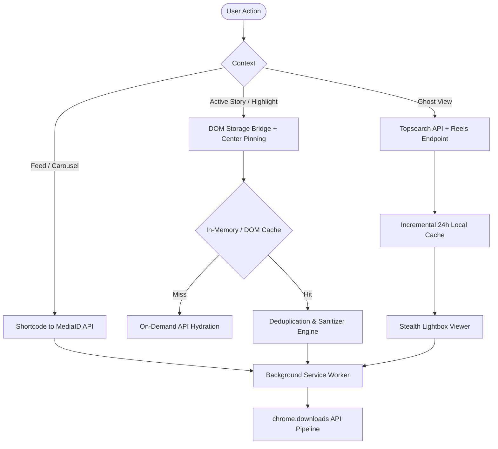

# Downplaygram

> **The zero-telemetry, client-side Instagram media extractor and stealth story viewer built for Chromium Manifest V3.**

[](https://developer.chrome.com/docs/extensions/mv3/intro/)
[](https://wxt.dev/)
[](https://www.typescriptlang.org/)
[](https://vitest.dev/)
[](LICENSE)

---

## 🌟 Overview

Conventional Instagram downloaders compromise user privacy by transmitting credentials and cookies to external servers. They lose media quality through DOM canvas dumps, suffer from broken DASH audio/video separation, and fail on 4–10 slide carousels due to React virtualization and sliding window pagination. Downplaygram solves all three problems entirely on the client side: zero telemetry, native in-feed integration above Instagram's UI buttons, and progressive MP4 extraction without quality compromise. All processing occurs in the user's browser using the active Instagram session — no credentials, no external APIs, no compromise.

---

## ⚡ Key Features

| Feature | Description | Architecture Highlights |
| :--- | :--- | :--- |
| **Feed & Carousels** | Download the visible slide or batch download all media (up to 10+ slides). | BigInt MediaId decoding, bypasses DOM virtualization via internal Web API hydration. |
| **Reels Downloader** | Native download button positioned precisely above the Like button. | MutationObserver resilient to infinite-scroll virtual DOM recycling. |
| **Stories Downloader** | Download the active story or batch download all user stories. | Triple-Lock Isolation (Username Firewall + Viewport Center Pinning + Cache Fallback). |
| **Highlights Downloader** | Extract entire highlights without limits. | Double-Lock Deduplication Guard (`highlight:{id}`) eliminates server-side duplicate payloads (`json.reels` vs `json.reels_media`). |
| **Quick Anonymous View** | View and save stories without being recorded as a viewer. | Zero-beacon in-modal Lightbox, 24h incremental cache merging via `chrome.storage.local`. |
| **Micro-Interactions** | Fully responsive UI with pure vector SVG and CSS animations. | Circular spinner, spring-checkmark pop-in, subtle shake error — zero raw emoji characters. |

---

## 🧠 Engineering Breakthroughs & Deep Dive

### 1. Beating React DOM Virtualization (Carousels)

**The Challenge:** Instagram unmounts off-screen elements in carousels and clips dots pagination to a 5-dot sliding window, making DOM element counting and scraping fail on 4–10 slide posts.

**The Solution:** Direct shortcode-to-MediaId BigInt decoding combined with official Web API hydration (`/api/v1/media/{mediaId}/info/`) and viewport center pinning for active slide detection. When DOM-based extraction is required, the observer pins to the viewport center rather than relying on sequential DOM node counts.

The `shortcodeToMediaId()` function converts Instagram's base-62 alphanumeric shortcodes into numeric Media IDs usable by the official Web API. The `/api/v1/media/{mediaId}/info/` endpoint returns complete media metadata including all carousel children, bypassing DOM virtualization entirely.

### 2. Main World Bridge & Triple-Lock Story Filter

**The Challenge:** Asynchronous `CustomEvent` communication between the Main World interceptor and Isolated World content scripts led to race conditions on cold reloads (`F5`).

**The Solution:** Injected hidden DOM storage bridge (`<script id="__downplaygram_store__" type="application/json">`) ensuring 100% synchronous data hydration upon script initialization. The story extraction pipeline applies three independent locks before returning any media:

1. **URL Username Firewall:** Extracts the target username from the current URL path (`/stories/{username}/{mediaId}/`) and only processes media matching that username.
2. **Viewport Center Pinning:** Uses `document.elementsFromPoint(centerX, centerY)` to find the card under the viewport center, ensuring only the active story is captured regardless of DOM order.
3. **Array Fallback Purge:** When cache is empty, `fetchUserStoriesOnDemand()` hydrates from the Web API, then filters results strictly by username before any index-based access.

### 3. Highlights Single-Source Deduplication

**The Challenge:** Instagram serves dual payloads on highlights endpoints (`json.reels` vs `json.reels_media`), causing duplicate media entries and `$2 \times N$` slide counts during batch download.

**The Solution:** Strict deduplication guard using a `Set` keyed by Media ID. The `upsertCarouselData()` function merges new items with existing cache, checking `item.url` equality before push. This guarantees total slide accuracy (not $2 \times N$) and deduplication-free file downloads on the first pass.

### 4. Network-First Stealth Story Engine

**The Challenge:** Traditional ghost modes intercepting `/seen/` beacons frequently leak view receipts upon DOM updates.

**The Solution:** Dedicated client-side in-page Lightbox viewer powered by `topsearch` and `reels_media` queries that never dispatch view receipts, paired with an incremental 24-hour local cache in `chrome.storage.local`. The `declarativeNetRequest` dynamic rule (`Rule 1001`) blocks `*://*.instagram.com/api/v1/stories/reel/seen/*` for all resource types (XMLHttpRequest, ping, other) before the beacon can be dispatched. The `fetchAnonymousStories()` function implements network-first with incremental cache merge: always fetch latest from server, then merge with existing local cache by unique ID, never replacing entirely.

### 5. Interactive Micro-Interaction Design System

**The Challenge:** Raw emoji characters (`⏳`, `✅`, `❌`, etc.) scattered across UI components create visual inconsistency and accessibility issues.

**The Solution:** Complete removal of all raw emoji characters. Replacement with a handcrafted SVG icon system (Feather/Lucide style) and CSS keyframe animations defined in `src/ui/icons.ts`:

- `dpg-spin`: 0.75s linear infinite circular rotation (loading spinners)
- `dpg-pop`: 0.28s cubic-bezier forward pop-in (success checkmark)
- `dpg-shake`: 0.35s ease-in-out forward (error shake)

All SVG icons are stroke-based with currentColor inheritance, supporting dark mode automatically. The `GLOBAL_ANIMATION_CSS` constant injects these keyframes once into the page, and every icon function (`iconSpinner()`, `iconSuccess()`, `iconError()`) calls `injectGlobalAnimations()` to ensure the CSS exists.

---

## 🏗️ Architecture & Data Flow



---

## 🎨 Interactive Micro-Interactions System

The micro-interaction design system is implemented entirely in `src/ui/icons.ts`. All SVG icons use stroke-based rendering with `currentColor` for automatic dark mode support. Three CSS keyframe animations are defined:

- `dpg-spin`: 0.75s linear infinite — continuous circular rotation for loading states
- `dpg-pop`: 0.28s cubic-bezier(0.175, 0.885, 0.32, 1.275) forwards — spring-backed pop-in for success checkmarks
- `dpg-shake`: 0.35s ease-in-out forwards — subtle horizontal shake for error states

Every icon function (`iconSpinner()`, `iconSuccess()`, `iconError()`) calls `injectGlobalAnimations()` to ensure the stylesheet is injected into the DOM only once, avoiding duplicate `<style>` elements. The `dpg-error-shake` class is applied to error UI elements in the lightbox and feed injectors, providing consistent visual feedback across all components.

---

## 🛠️ Tech Stack & Tooling

| Layer | Technology |
|---|---|
| **Core Engine** | TypeScript, Chromium Manifest V3 |
| **Framework & Bundler** | WXT Framework, Vite |
| **Testing Suite** | Vitest (unit & integration tests) |
| **APIs Utilized** | Instagram Internal Web API, `chrome.storage.local`, `chrome.downloads`, `chrome.runtime`, `declarativeNetRequest` |
| **Media Processing** | `mp4-muxer` library, WebCodecs, WebFont encoding |
| **CSS Styling** | Custom properties, backdrop-filter, glassmorphism design |
| **Icon System** | Handcrafted SVG with CSS keyframe animations (`dpg-spin`, `dpg-pop`, `dpg-shake`) |

---

## 🚀 Getting Started & Local Development

```bash
# Clone the repository
git clone https://github.com/username/downplaygram.git
cd downplaygram

# Install dependencies
npm install

# Run Vitest test suite
npm test

# Typecheck & Build extension for Chrome
npm run compile
npm run build

# Loading Extension into Chrome:
# 1. Open chrome://extensions/ in a Chromium-based browser
# 2. Enable "Developer mode" (toggle top-right)
# 3. Click "Load unpacked" and select the .output/chrome-mv3 directory
```

---

## 📂 Project Structure

```text
downplaygram/
├── .wxt/                    # WXT internal configuration
├── .output/                 # Built output (chrome-mv3, firefox, edge)
├── CHROMEWEBSTORE.md        # Chrome Web Store submission guide
├── LICENSE                  # MIT license file
├── packages/                # (if any monorepo packages)
├── prd-downplaygram-v3.md   # Product Requirements Document
├── package.json             # Project metadata + scripts
├── tsconfig.json            # TypeScript configuration
├── vitest.config.mts        # Vitest test configuration
├── wxt.config.ts            # WXT manifest + permissions config
│
├── src/
│   ├── background/          # Service worker: ghost-engine, download handling
│   │   ├── ghost-engine.ts   # declarativeNetRequest rules (Ghost Mode)
│   │   └── index.ts          # Service worker entry point
│   │
│   ├── content/             # Injected content scripts (runs on instagram.com/*)
│   │   ├── index.ts          # Main content script orchestrator
│   │   ├── observer.ts       # MutationObserver + SPA navigation engine
│   │   ├── ghost-hub/      # Floating Ghost Hub (Shadow DOM docked UX)
│   │   │   ├── GhostHub.ts   # Custom element: downplaygram-ghost-hub
│   │   │   ├── lightbox.ts   # In-memory zero-telemetry ghost lightbox
│   │   │   └── index.ts      # Mount point for GhostHub component
│   │   ├── injectors/      # Contextual button injectors
│   │   │   ├── feed.ts       # Feed post & carousel download buttons
│   │   │   ├── reels.ts      # Reels download button (above Like)
│   │   │   ├── stories.ts    # Stories download button (bottom action row)
│   │   │   └── profile.ts    # HD Avatar download overlay
│   │   └── ghost-hub/      # Lightbox component (in-memory viewer)
│   │
│   ├── lib/                 # Core libraries & processing pipelines
│   │   ├── anonymous-service.ts  # Network-first story hydration with 24h cache merge
│   │   ├── downloader.ts         # chrome.downloads wrapper + batch throttle
│   │   ├── media-cache.ts        # In-memory cache + DOM storage bridge sync
│   │   ├── media-sniffer.ts      # CDN sniffing, DASH filtering, URL extraction
│   │   ├── runtime.ts            # Safe messaging + context validation
│   │   ├── sanitizer.ts          # OS-path-safe filename/username sanitization
│   │   └── video-synthesizer.ts  # WebCodecs + mp4-muxer: photo+audio → MP4 video
│   │
│   ├── popup/               # Browser action popup (quick anonymous viewer)
│   │   ├── index.html          # Popup markup
│   │   ├── main.ts             # Popup logic: form submit → open lightbox
│   │   └── style.css           # Popup styling (black theme, accent purple)
│   │
│   ├── storage/             # chrome.storage.local persistence
│   │   └── settings.ts         # Ghost mode state + user preferences
│   │
│   └── ui/                  # Reusable UI components & icons
│       └── icons.ts            # SVG icon definitions + CSS keyframe animations
│
├── tests/                   # Vitest unit & integration tests
│   ├── anonymous-service.test.ts
│   ├── feed-injector.test.ts
│   ├── highlights.test.ts
│   ├── icons.test.ts
│   ├── media-sniffer.test.ts
│   ├── reels-injector.test.ts
│   ├── sanitizer.test.ts
│   ├── story-tray.test.ts
│   └── video-synthesizer.test.ts
│
├── public/
│   └── manifest.json         # (generated by WXT build; overridden in wxt.config.ts)
│
└── README.md                # This file
```

---

## ⚖️ Legal Disclaimer

Downplaygram is an independent open-source project developed for personal archiving and educational purposes only. It is not affiliated with, authorized, maintained, sponsored, or endorsed by Meta Platforms, Inc. or Instagram. All trademarks and registered trademarks belong to their respective owners.

---

## 📄 License

Distributed under the MIT License. See LICENSE for details.